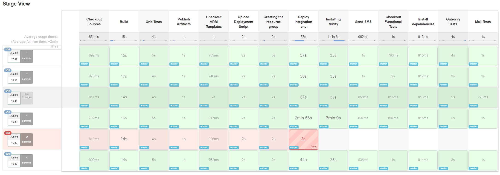

# Learnings from a DevOps Hackfest with Azzimov #

Azzimov teamed up with Microsoft to implement DevOps practices into their processes. This report describes the steps we took and the results. The practices we focused on include:  

* Unit Testing  
* Continuous Integration with Jenkins  
* Continuous Deployment  
* Integration Testing  

The core hacking team was composed of:  

* Kevork Aghazarian - Project Manager   
* Yassine Zeroual - System Administrator  
* Prasad Perera - Backend Developer  
* Yanick Plamondon - Backend Developer  
* Julien Stroheker ([@Ju_Stroh](https://twitter.com/Ju_Stroh)) - Technical Evangelist at Microsoft  
* William Buchwalter ([@wbuchw](https://twitter.com/wbuchw)) - Technical Evangelist at Microsoft  

## Customer profile ##
[Azzimov](http://www.azzimov.com/en/about) is a startup based in Montreal, Canada, that delivers a virtual shopping mall solution leveraging machine learning. The main focus of this Hackfest was to increase the quality and the reliability of the product and its deployments.

## Problem statement ##

Azzimov is a very agile organization, which is why they have been able to bring innovative solutions to the market consistently for many years. Keeping the same pace of delivery becomes harder as the company grows. A lot of organizations do not realize that and hire new people regularly to counter the productivity loss, creating even more technical debt in the long run. The other, better solution is to invest time in managing and reducing the technical debt early and continuously. 

That is the approach Azzimov chose. The team put the emphasis on two aspects:  

* Quality: Minimizing issues and downtime in production when releasing new features.
* Time to market: Increasing even more their ability to ship fast and stay ahead of their market. 

### Current architecture ###

Azzimov's architecture is very granular, with each component being isolated. This is a very good practice that makes changing any one of the components much easier (and that was great for our Hackfest). It would also greatly simplify moving to a container-based architecture, but that's for another day.

For the purpose of this Hackfest, we decided to hack their most complicated component: **Trinity Gateway**.
If we managed to do something meaningful there, then Azzimov's team was confident they could implement similar practices for their other components.

Trinity Gateway is a Java-based service that acts as an orchestrator for every other service in the solution.

## Solutions, steps, and delivery ##

The first day of the Hackfest was dedicated to Value Stream Mapping. This process allows us to quickly capture the waste and issues in the workflow from ideation to production.

The exercise let us quickly see areas for improvement. First, we saw that not enough quality checks were in place to reach the level of quality that Azzimov wants. We also found that the mean lead time from the planning of a feature to its release in production is around five weeks. This lead time was probably somewhat optimistic, but not far from the truth.

Ultimately, the goal of DevOps is to reduce this lead time as much as possible to allow rapid feedback and iteration, but in order to do that, we need a way to be confident in the quality of our product.

For these reasons we decided to focus first on Continuous Integration and Continous Deployment of new changes into a staging environment. If done properly, this would allow us to catch any issues much faster than currently, and most importantly, to spot them before they impact a customer. These basic building blocks of DevOps can be expanded on later.

Because Azzimov's team already had some experience with Jenkins, we decided to go ahead and use it.
Because we love automation, and we don't want to set up anything manually, we deployed a new Jenkins instance on Azure using an [Azure Resource Manager (ARM) template](https://github.com/Azure/azure-quickstart-templates/tree/master/jenkins-on-ubuntu) that can be parameterized to set up any number of nodes.

Once Jenkins was set up, we split the work between two teams: 

* One would work on Continuous Integration.
* The other would work on automating deployment on a staging environment.

### Continuous Integration

One of the main painpoints that we identified during the Value Stream Mapping was the lack of tooling that could  help Azzimov to implement some DevOps practices.

From the build to the release, there were a lot of manual steps. The build (using Maven 2) was also executed manually from a developer machine. Although this is a very common practice, automating much of these steps can significantly reduce their lead time and improve quality.

We explored the concept of Continuous Integration and the possibility of building the code at each commit in their GitHub repository, as well as the impact of adding unit tests and running them at build time.

We decided to automate those tasks and create a pipeline project in Jenkins 2.0 made up of the following four stages:

* **Check out sources**: Classic Git clone of the repository.
* **Build**: Building the .jar file with Maven.
* **Unit tests**: Run a shell command to execute the JUnit tests in the project.
* **Publish artifacts**: Upload the .jar file into Azure Blob storage, ready to be deployed.

Here is the code of this pipeline in Jenkins:

  
  node {
    ws('/var/lib/jenkins/workspace/trinity') {
      // Get the maven tool.
      def mvnHome = '/usr/share/maven'

      stage 'Checkout Sources'
        git branch: 'feature/jenkin_integration', credentialsId: 'XXXXX', url: 'https://github.com/XXXXX/YYYYY'

      stage 'Build'
        sh "${mvnHome}/bin/mvn clean install -DskipTests"

      stage 'Unit Tests'
        sh "${mvnHome}/bin/mvn test"
        step([$class: 'JUnitResultArchiver', testResults: '**/target/surefire-reports/TEST-*.xml'])

      //publish the war file to azure, so it can be used later to setup a new VM  
      stage 'Publish Artifacts'
        sh "azure storage blob upload -q -a \"azziartifacts\" -k \"XXXX" \"target/SearchGateway.war\" \"trinity\""
    }
  

The next step was to deploy this artifact (.jar) automatically in a new environment to run the integration tests.

### Continuous Deployment to staging

The idea was to automatically deploy the artifact previously built in an environment, ready to be tested. For this step, we introduced the concepts of Infrastructure as Code and Configuration Management on Microsoft Azure to  Azzimov's team.

First, we had to define the needs for the application:

* An Ubuntu environment
* Java Development Kit installed (JDK)
* Tomcat binaries
* Download the artifact from Azure Blob storage
* Launch Tomcat on the port 8080 with the .jar file

With an ARM template, we automated the deployment of one virtual machine running Ubuntu on Azure. When this deployment was done, we added a custom extension written on shell to run our custom settings.

One interesting countermeasure that we had to find was the way to automatically accept the license agreement from Java:

We used the '**echo debconf**' command to remediate to it. (See the next snippet.)

Here is a piece of code from the shell script that we pushed as a custom extension in the virtual machine:


sudo add-apt-repository -y ppa:webupd8team/java
sudo apt-get -y update
echo debconf shared/accepted-oracle-license-v1-1 select true | sudo debconf-set-selections
echo debconf shared/accepted-oracle-license-v1-1 seen true | sudo debconf-set-selections
sudo apt-get -y install oracle-java7-installer
sudo apt-get -y install oracle-java7-set-default


Now that we have one .json file containing our Infrastructure as Code part and one shell script containing our Configuration part, we are ready to execute it any time we want.

[*To see the code for the ARM template + the extension, click here.*](https://github.com/julienstroheker/AzzimovARM)

Here are the related Jenkins steps:

* **Check out ARM template**: Make a Git clone of the repository containing the ARM template and shell script.
* **Upload deployment script**: Upload the shell file into Azure Blob storage, ready to be executed as a custom extension.
* **Create resource group**: Execute an Azure CLI command to create a resource group on Azure where we will deploy our environment.
* **Deploy integration env**: Execute an Azure CLI command to deploy our environment thanks to our ARM template.
* **Install Trinity**: Add a custom extension on the virtual machine previously created to execute our shell script.
* **Send SMS**: Send a text message to an Ops contact to acknowledge the deployment using [Trello's](www.trello.com) API.

Here is what the code looks like:


   ws('/var/lib/jenkins/workspace/trinity-deploy') {
    stage 'Checkout ARM Templates'
      git credentialsId: 'xxxx', url: 'https://github.com/xxxx/xxxx.git'

    stage 'Upload Deployment Script'
      sh "azure storage blob upload -q -a \"azziartifacts\" -k \"XXXX\" \"./scripts/deploy_gw.sh\" \"trinity\" "
      sh "azure storage blob upload -q -a \"azziartifacts\" -k \"XXXX\" \"./scripts/installTrinityExtension.sh\" \"trinity\" "

    stage 'Creating the resource group'
      sh "azure group create -n TrinityIntegration -l \"Canada East\""

    stage 'Deploy Integration env'
      sh "azure group deployment create -f azuredeploy.json -e azuredeploy.parameters.integration.json -g TrinityIntegration -n DeploymentTrinityInt"

    stage 'Installing Trinity'
      sh "/usr/bin/sudo /bin/sh ./scripts/installTrinityExtension.sh"

    stage 'Send SMS'
      sh "/usr/bin/sudo /bin/sh ./scripts/sendsms.sh"
   }
   

### Functional testing
We then decided to push ahead with our objective of improving quality.
One of the issue is that the existing code base has not enough unit tests. As any developer will tell you, adding unit test to an existing code base that was written by someone else is a very hard task. If the codebase is somewhat large this can be a huge time investment.

While it is probably always worth going back and adding unit test to critical pieces of the application, functional tests will offer a better return on investment on the short term. By testing the whole stack, we can quickly make sure everything is working as expected before a release with minimal efforts.  

During the Value Stream Mapping we identified that the team did some manual sanity checks using curl before going into production.
We decided to create a new repository containing functional tests for all the different services, and capture the manual tests as a first step.

We decided to use Node.js for functional testing for multiple reasons:
  * Easy to pick up, and some developer already have experience with it.
  * With a library such as [mocha](https://mochajs.org/) we can easily export test results in an xUnit format to display them in Jenkins
  * Libraries such as [phantomjs](http://phantomjs.org/) will make UI testing easier on a build agent.

Here is an example of what this new tests look like:


require('isomorphic-fetch');
var expect = require('expect');

describe('Connection tests', function() {
this.timeout(5000);  
  it('Initiate Session and Test MySQl connection', function(done) {
    fetch('http://someinternalurl.com:8080/')
      .then(res => res.json())
      .then(res => {
        expect(res.status).toEqual(1);
        done();
      })
      .catch(err => done(err));    
  })
});


We then hooked this tests into the Jenkinsfile so that they are executed once the environment finishes deploying.


ws('/var/lib/jenkins/workspace/trinity-tests') {
    stage 'Checkout Functional Tests'
      git branch: 'master', url: 'https://github.com/xxxx/xxxx'

    stage 'Install dependencies'
      sh 'npm i'

    stage 'Gateway Tests'
      sh 'npm run gateway'

    stage 'Mall Tests'
      sh 'npm run mall'

    stage 'Archiving Test Results'
      //This step archive the xml file containing testresults to display them in jenkins UI
      step([$class: 'JUnitResultArchiver', testResults: '*.xml'])
  }


## Conclusion ##
While we can only do so much in 3 days, continuous integration, the addition of critical unit tests, and automated integration tests should already make a difference in the stability of the application when releasing a new update.
In the mean time, continuous deployment will help reduce the lead time by letting developers verify their changes more often, thus detecting issues before they reach production.  

Jenkins 2.0 new pipeline feature has proved very flexible and easy to use. Since everything is code, maintaining and evolving continuous integration and continuous deployment pipelines is straightforward.

Here is the stage view of our completed Jenkins pipeline:

A lot of improvement can be made to this script, among which:  

* Using Jenkins variable to detect the current branch, and deploy in production (or staging) when on `master`  
* Deploy a temporary environment on Azure for every commit using the ARM templates, run the functional tests on this envrionment and automatically deprovision it.   

## Resources ##  

* [Jenkins's Pipeline tutorial on GitHub](https://github.com/jenkinsci/pipeline-plugin/blob/master/TUTORIAL.md)
* [ARM template + the VM extension that we used](https://github.com/julienstroheker/AzzimovARM)

